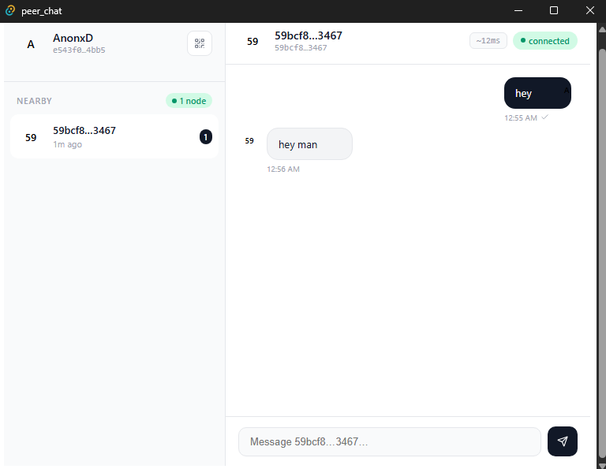

# peerChat

## Serverless P2P chat. No accounts. No servers. Ever.

peerChat connects you directly to anyone — on your local network or anywhere in the world — with no server in the middle, no account required, and nothing to configure.

Your messages go from you to them. That's it.

## How it works

peerChat has two modes that work seamlessly together:

- **Local network** — automatically discovers and connects to anyone running peerChat on the same network. Zero configuration, works instantly.
- **Anywhere** — exchange public keys with anyone in the world and chat directly, peer-to-peer, no middleman, no internet infrastructure required beyond the connection itself. (coming soon)

## Why peerChat

Every chat app today routes your messages through a server — even "encrypted" ones. That server can go down, get blocked, get hacked, or get subpoenaed.

peerChat has no server to go down. No server to block. No server to hack. No server to subpoena.

This makes it particularly valuable where infrastructure is unreliable, where privacy is critical, or where you simply don't want a third party involved in your conversations.

## Features

- **Auto-discover** peers on your local network — no setup
- **Connect globally** by exchanging public keys (coming soon)
- **No servers** — truly peer-to-peer, always
- **No accounts, no phone number, no email**
- **No tracking, no analytics, no ads**
- **Works without internet** on local networks
- **Works across the internet** with public key exchange

## Alpha Status

This is **early alpha software**. Core messaging works. More is coming.

**Works now:**
- [x] Install and run
- [x] Auto-discover people on your local network
- [x] Send and receive messages in real time

**Coming soon:**
- [ ] Connect to any node by public key (global P2P)
- [ ] Message persistence
- [ ] File sharing
- [ ] End-to-end encryption
- [ ] Mobile support

## Download

Get the latest Windows release from [Releases](https://github.com/korir248/peer_chat/releases)

1. Download `.msi` or `.exe`
2. Install and run
3. Set your alias
4. Chat with anyone on your network running peerChat — or share your public key to connect anywhere

## Perfect for

- **Privacy-conscious users** — no server ever sees your messages
- **Low-infrastructure environments** — works where internet is unreliable or unavailable
- **Local networks** — offices, schools, events, LAN parties
- **Censorship-resistant communication** — no central point to block
- **Developers** — open source, built in Rust and Tauri

## Built With

- [Tauri](https://tauri.app/) — Desktop framework
- [Rust](https://www.rust-lang.org/) — Performance and safety
- Custom P2P networking layer

## License

AGPL-3.0

See [LICENSE](LICENSE) for details.

---

**Questions or feedback?** [Open an issue](https://github.com/korir248/peer_chat/issues)
